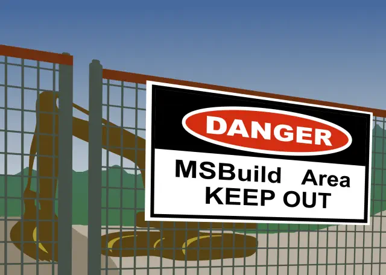

# MSBuild for Programming and Non‑Programming Chores

Generic .NET MSBuild project demonstrating both programming and non-programming use of MSBuild. It runs FFmpeg with different inputs, file types, and options for transcoding media files supported by FFmpeg.

Tested on Windows and Linux

Original publication: [MSBuild for Programming and Non-Programming Chores](https://www.codeproject.com/Articles/5369187/dotnet-msbuild-nonprogramming)

